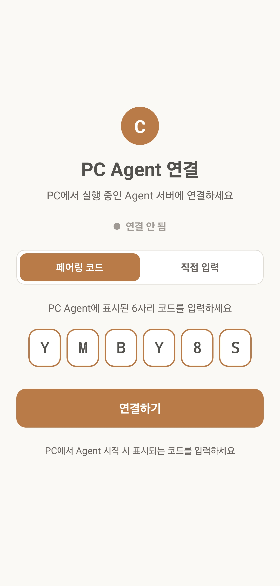
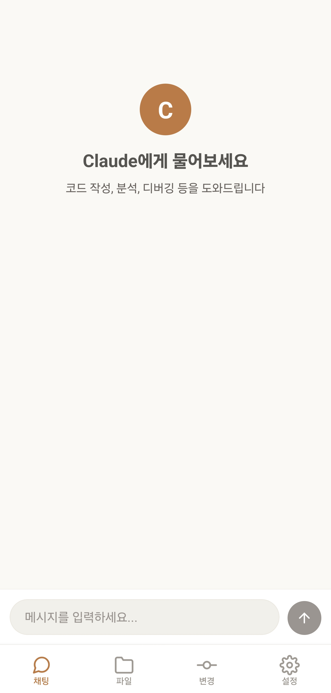
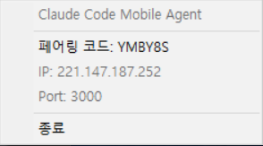

# Claude Mobile Remote

> 모바일에서 PC의 Claude Code CLI를 원격 제어하는 앱


## 스크린샷

<p align="center">
  
  
  
</p>
<p align="center">
  <em>연결 화면 &nbsp;|&nbsp; 채팅 화면 &nbsp;|&nbsp; PC Agent 시스템 트레이</em>
</p>

---

## 프로젝트 개요

기존 원격 데스크톱(Chrome Remote Desktop, TeamViewer)은 화면 전체를 스트리밍하기 때문에 모바일에서 사용하기 불편합니다.
Claude Mobile Remote는 **텍스트만 주고받는 방식**으로, 모바일에 최적화된 UI를 제공합니다.

| 기존 원격 데스크톱 | Claude Mobile Remote |
|-------------------|---------------------|
| 전체 화면 스트리밍 (무거움) | 텍스트만 전송 (가벼움) |
| 작은 글씨, 확대 필요 | 모바일 최적화 UI |
| 마우스 조작 어색 | 터치 네이티브 |
| 데이터/배터리 소모 큼 | 최소 데이터, 효율적 |

---

## 시스템 아키텍처

```
┌──────────────┐         ┌───────────────────┐         ┌──────────────┐
│  모바일 앱    │◄───────►│  시그널링 서버      │◄───────►│  PC Agent    │
│ (React Native)│  HTTPS  │(Cloudflare Workers)│  HTTPS  │  (NestJS)    │
└──────┬───────┘         └───────────────────┘         └──────┬───────┘
       │                                                       │
       │              WebSocket (직접 연결)                      │
       └──────────────────────────────────────────────────────┘
                                                               │
                                                      ┌───────▼───────┐
                                                      │ Claude Code   │
                                                      │ CLI (spawn)   │
                                                      └───────────────┘
```

**연결 흐름:**
1. PC Agent가 시그널링 서버에 페어링 코드 등록
2. 모바일 앱에서 페어링 코드 입력 → PC의 IP/Port 수신
3. 모바일 ↔ PC 직접 WebSocket 연결

---

## 기능

### 모바일 앱
- 프롬프트 입력 및 응답 스트리밍
- 마크다운 렌더링 + 코드 구문 강조
- 파일 탐색기 (폴더 트리, 파일 뷰어)
- 파일 관리 (생성, 삭제, 이름변경)
- 파일/내용 검색
- 변경사항 추적 (Diff 뷰어, 승인/거부)
- 세션 종료 / 응답 중단
- 다크 모드

### PC Agent
- Claude Code CLI 실행 및 출력 스트리밍
- WebSocket 서버 (socket.io)
- 파일 시스템 API (탐색, 읽기, 쓰기, 검색)
- 변경사항 추적 시스템
- 시스템 트레이 (백그라운드 실행)
- Windows 인스톨러

### 시그널링 서버
- Cloudflare Workers + KV
- 페어링 코드 기반 P2P 연결 중개

---

## 프로젝트 구조

```
claude-mobile-remote/
├── mobile-app/                 # React Native 모바일 앱
│   └── src/
│       ├── components/         # UI 컴포넌트 (CodeBlock, MarkdownMessage 등)
│       ├── screens/            # 화면 (Chat, Files, Changes, Settings 등)
│       ├── hooks/              # 커스텀 훅 (useConnection)
│       ├── services/           # Socket, Signaling, Storage 서비스
│       ├── navigation/         # React Navigation 설정
│       ├── theme/              # 테마 (다크모드, 색상)
│       └── types/              # TypeScript 타입
│
├── pc-agent/                   # NestJS PC 에이전트
│   ├── src/
│   │   ├── events/             # WebSocket 게이트웨이 + 서비스들
│   │   ├── signaling/          # 시그널링 서버 연동
│   │   ├── tray/               # 시스템 트레이
│   │   └── common/             # 상수, 인터페이스, 유틸
│   ├── installer/              # Windows 인스톨러 (Inno Setup)
│   └── scripts/                # 빌드 스크립트
│
└── signaling-server/           # Cloudflare Workers 시그널링 서버
    └── src/
        └── index.ts            # Worker 엔트리포인트
```

---

## 시작하기

### 사전 요구사항
- Node.js 18+
- Claude Code CLI 설치 및 로그인 완료
- Expo Go 앱 (모바일 테스트용)

### PC Agent 실행

```bash
cd pc-agent
npm install
npm run start:dev
```

실행하면 페어링 코드가 시스템 트레이에 표시됩니다.

### 모바일 앱 실행

```bash
cd mobile-app
npm install
npx expo start
```

Expo Go 앱에서 QR 스캔 후 페어링 코드를 입력하면 연결됩니다.

### 시그널링 서버 배포

```bash
cd signaling-server
npm install
npx wrangler deploy
```

---

## 빌드

### 모바일 APK 빌드

```bash
cd mobile-app
eas build --platform android --profile preview
```

### PC Agent 인스톨러 빌드

```bash
cd pc-agent
npm run build:installer
# installer/output/ 에 Setup exe 생성
```

Inno Setup이 설치되어 있어야 합니다.

---

## 라이센스

MIT License
